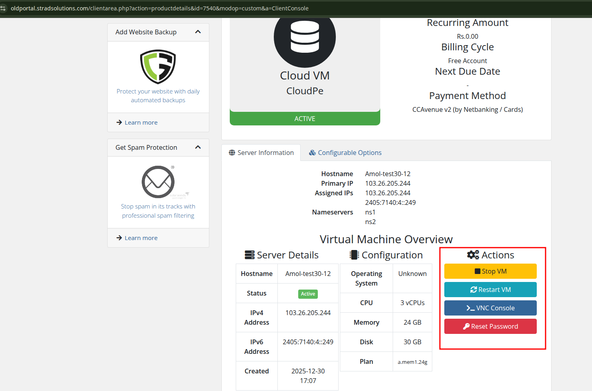

# Bug: Client Area VM Actions Not Working

**Date Reported:** 2026-01-09
**Date Fixed:** 2026-01-09
**Status:** Fixed in v3.43
**Severity:** High
**Affected Components:** Client area VM actions (Start, Stop, Restart, VNC Console, Reset Password)

## Problem

The client area VM actions (Stop VM, Restart VM, VNC Console, Reset Password) shown in the "Actions" panel are not working. Users click the buttons but nothing happens and no error messages are displayed.



## Root Causes

### Issue 1: Method Name Mismatch (VNC Console - Fatal Error)

**Location:** `modules/servers/cloudpe/cloudpe.php` lines 862, 1106

The code calls a method that doesn't exist in the API class:

```php
// Code calls:
$result = $api->getVncConsole($serverId);  // Method doesn't exist!

// But CloudPeAPI.php defines:
public function getConsoleUrl(string $serverId, string $type = 'novnc'): array
```

**Impact:** Clicking "VNC Console" triggers a fatal PHP error: `Call to undefined method CloudPeAPI::getVncConsole()`

### Issue 2: Return Value Format Mismatch (VNC Console)

**Location:** `modules/servers/cloudpe/cloudpe.php` line 1110

Even if the method name is fixed, the return value handling is incorrect:

```php
// cloudpe_ClientConsole() expects:
if ($result['success'] && !empty($result['console']['url'])) {
    header('Location: ' . $result['console']['url']);
}

// But getConsoleUrl() returns:
return ['success' => true, 'url' => $url];  // No 'console' key!
```

**Impact:** Even with correct method name, the redirect URL would never be extracted.

### Issue 3: WHMCS Silent Error Handling

**Location:** All client area functions in `modules/servers/cloudpe/cloudpe.php`

WHMCS does not display error strings returned by client area custom functions. When functions return errors like `'Failed: ...'` or `'Error: ...'`, WHMCS simply redirects back to the product details page without showing any message.

```php
function cloudpe_ClientStop(array $params): string {
    // ...
    if (!$result['success']) {
        return 'Failed: ' . ($result['error'] ?? 'Unknown error');  // User never sees this!
    }
    // ...
}
```

**Impact:** All API failures, authentication errors, or validation errors are silently swallowed.

## Affected Functions

| Function                         | File Location    | Issue                                      |
| -------------------------------- | ---------------- | ------------------------------------------ |
| `cloudpe_ClientStart()`          | cloudpe.php:958  | Silent error handling                      |
| `cloudpe_ClientStop()`           | cloudpe.php:1008 | Silent error handling                      |
| `cloudpe_ClientRestart()`        | cloudpe.php:1046 | Silent error handling                      |
| `cloudpe_ClientConsole()`        | cloudpe.php:1096 | Method name + return value + silent errors |
| `cloudpe_ClientChangePassword()` | cloudpe.php:1122 | Silent error handling                      |

## Solution (v3.41 - Partial Fix)

### Fix 1: Correct Method Name (v3.41)

Change `getVncConsole` to `getConsoleUrl` at:

- Line 862 (admin area console)
- Line 1106 (client area console)

### Fix 2: Correct Return Value Handling (v3.41)

Update `cloudpe_ClientConsole()` to use `$result['url']` instead of `$result['console']['url']`:

```php
if ($result['success'] && !empty($result['url'])) {
    header('Location: ' . $result['url']);
    exit;
}
```

### Fix 3: Add User-Visible Error Messages (v3.41 - Did Not Work)

Attempted session-based messaging to display errors/success to users. **This approach failed** because WHMCS redirects clear session variables before they can be displayed:

1. Set messages in session before returning:

```php
$_SESSION['cloudpe_message'] = 'VM stopped successfully';
$_SESSION['cloudpe_message_type'] = 'success';
```

2. Pass messages to template in `cloudpe_ClientArea()`:

```php
$message = $_SESSION['cloudpe_message'] ?? null;
$messageType = $_SESSION['cloudpe_message_type'] ?? 'info';
unset($_SESSION['cloudpe_message'], $_SESSION['cloudpe_message_type']);
```

3. Display in `templates/overview.tpl`:

```smarty
{if $cloudpe_message}
    <div class="alert alert-{$cloudpe_message_type|default:'info'} alert-dismissible">
        <button type="button" class="close" data-dismiss="alert">&times;</button>
        {$cloudpe_message}
    </div>
{/if}
```

## Files Modified

### v3.41 (Partial)
1. `modules/servers/cloudpe/cloudpe.php`
   - Fixed method name `getVncConsole` → `getConsoleUrl` (2 locations)
   - Fixed return value handling `$result['console']['url']` → `$result['url']`

### v3.42 (Complete Fix)
1. `modules/servers/cloudpe/cloudpe.php`
   - Added `cloudpe_isAjax()` helper function
   - Added `cloudpe_jsonResponse()` helper function
   - Updated all 5 client functions to return JSON for AJAX requests
   - Removed session-based messaging code

2. `modules/servers/cloudpe/templates/overview.tpl`
   - Changed `<a href>` links to `<button onclick>` elements
   - Added JavaScript AJAX handlers (`cloudpeAction`, `cloudpeConsole`)
   - Added alert container, status cell, loading states
   - Added console logging for debugging

## Solution Implemented (v3.42)

Session-based messaging did not work because WHMCS redirects clear session variables. Implemented AJAX-based solution instead.

### PHP Changes (`cloudpe.php`)

Added AJAX detection and JSON response helpers:

```php
function cloudpe_isAjax(): bool
{
    return !empty($_SERVER['HTTP_X_REQUESTED_WITH']) &&
           strtolower($_SERVER['HTTP_X_REQUESTED_WITH']) === 'xmlhttprequest';
}

function cloudpe_jsonResponse(bool $success, string $message, array $data = []): void
{
    header('Content-Type: application/json');
    echo json_encode(array_merge(['success' => $success, 'message' => $message], $data));
    exit;
}
```

Updated all 5 client functions to return JSON when called via AJAX:
- `cloudpe_ClientStart()` - returns `{success, message, status}`
- `cloudpe_ClientStop()` - returns `{success, message, status}`
- `cloudpe_ClientRestart()` - returns `{success, message, status}`
- `cloudpe_ClientConsole()` - returns `{success, message, url}`
- `cloudpe_ClientChangePassword()` - returns `{success, message}`

### Template Changes (`overview.tpl`)

Changed from `<a href>` links to `<button onclick>` elements with JavaScript AJAX handlers:

```javascript
// Main action handler for Start/Stop/Restart/Password
function cloudpeAction(action, loadingMessage) {
    $.ajax({
        url: 'clientarea.php?action=productdetails&id=' + serviceId + '&modop=custom&a=' + action,
        headers: { 'X-Requested-With': 'XMLHttpRequest' },
        success: function(response) {
            if (response.success) {
                showAlert('success', response.message);
                setTimeout(function() { location.reload(); }, 2000);
            } else {
                showAlert('error', response.message);
            }
        }
    });
}

// Console handler - opens in new window
function cloudpeConsole() {
    $.ajax({
        url: 'clientarea.php?...&a=ClientConsole',
        success: function(response) {
            if (response.success && response.url) {
                window.open(response.url, '_blank');
            }
        }
    });
}
```

## Testing Checklist

### Core Functionality
- [x] VNC Console opens correctly
- [x] Stop VM shows success message
- [x] Stop VM shows error message on failure
- [x] Start VM shows success message
- [x] Start VM shows error message on failure
- [x] Restart VM shows success message
- [x] Restart VM shows error message on failure
- [x] Reset Password shows success message
- [x] Reset Password shows error message on failure

### AJAX Implementation (v3.42 - Did Not Work)
- [x] Buttons disabled during operation
- [x] Loading spinner shown during operation
- [x] Success alert displayed without page reload
- [x] Error alert displayed without page reload
- [x] Status label updates after action
- [x] Page auto-reloads after successful action (2 sec delay)
- [x] Confirmation dialog for destructive actions (Stop, Restart, Password)
- [x] Console opens in new window (not redirect)
- [x] Browser console logs for debugging (F12 → Console)
- [x] Network error handling (timeout, connection issues)
- [x] Buttons re-enabled after error

**Note:** v3.42 AJAX implementation failed because WHMCS intercepts `modop=custom` requests and redirects before JSON response reaches browser.

## Solution Implemented (v3.43 - Standalone AJAX Endpoint)

The final fix bypasses WHMCS routing entirely by creating a standalone AJAX endpoint.

### Why v3.42 Failed

WHMCS's `modop=custom` parameter triggers internal routing that:
1. Calls the module function
2. Captures the return value
3. Redirects back to the product details page
4. Never sends the JSON response to the browser

Even with `X-Requested-With: XMLHttpRequest` header, WHMCS still intercepts and redirects.

### v3.43 Solution: Standalone ajax.php

Created `modules/servers/cloudpe/ajax.php` that:
1. Loads WHMCS's `init.php` directly for database access
2. Validates client session (`$_SESSION['uid']`)
3. Verifies service ownership
4. Calls CloudPeAPI methods directly
5. Returns JSON response and exits (no WHMCS interference)

### Files Added/Modified

1. **NEW: `modules/servers/cloudpe/ajax.php`**
   - Standalone endpoint bypassing WHMCS routing
   - Actions: start, stop, restart, console, password
   - Security: session validation, service ownership check

2. **MODIFIED: `modules/servers/cloudpe/templates/overview.tpl`**
   - Uses `data-action` attributes on buttons
   - JavaScript calls `ajax.php` directly
   - Console opens in sized popup (1024x768)

3. **MODIFIED: `modules/servers/cloudpe/cloudpe.php`**
   - Added `WEB_ROOT` template variable for AJAX URL

### AJAX Endpoint URL Pattern

```javascript
var ajaxUrl = '{$WEB_ROOT}/modules/servers/cloudpe/ajax.php';
var requestUrl = ajaxUrl + '?action=' + action + '&service_id=' + serviceId;
```

### Security Implementation

```php
// Validate session
$clientId = (int)($_SESSION['uid'] ?? 0);
if ($clientId <= 0) {
    jsonResponse(false, 'Please log in to continue');
}

// Verify service ownership
$service = Capsule::table('tblhosting')
    ->where('tblhosting.id', $serviceId)
    ->where('tblhosting.userid', $clientId)
    ->where('tblproducts.servertype', 'cloudpe')
    ->first();
```

### Testing Checklist (v3.43)
- [ ] Start VM works without page reload
- [ ] Stop VM works without page reload
- [ ] Restart VM works without page reload
- [ ] VNC Console opens in popup window
- [ ] Reset Password works and shows message
- [ ] Error messages display correctly
- [ ] Console logging shows in browser F12
- [ ] Unauthorized access returns error
- [ ] Non-existent service returns error
